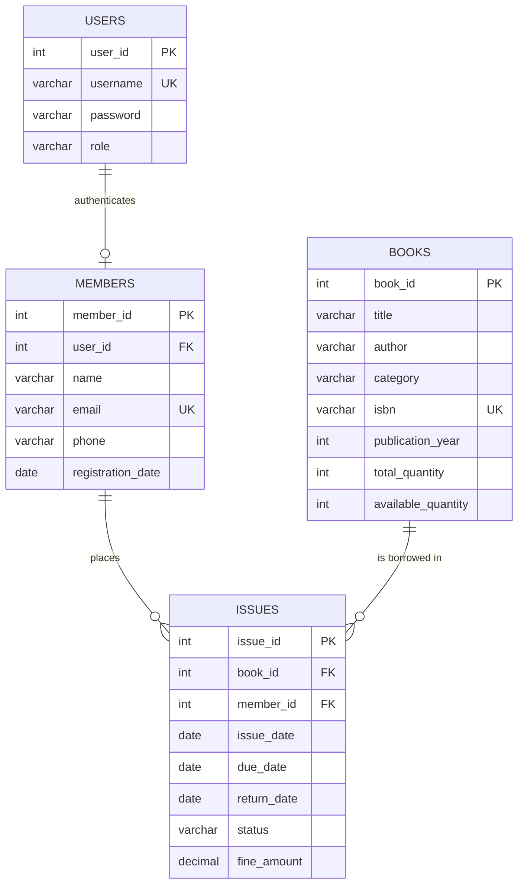

# Library Management System (Console Edition)

A modular, production-minded **Library Management System** built with **Core Java (JDK 8+)**, **JDBC**, and **MySQL**. 

This project demonstrates strong software engineering fundamentals: **Object-Oriented Design (OOP)**, **Separation of Concerns (Layered N-Tier Architecture)**, **ACID Database Transactions**, **Defensive Validation with Custom Exceptions**, and **Relational Database Normalization (3NF)**.

---

## Architecture Overview

The system strictly follows the **N-Tier Layered Architecture** (Model-View-Service-DAO), ensuring that business logic, data persistence, and console presentation are decoupled.

```
+--------------------------------------------------------------------------+
|                        PRESENTATION LAYER (UI)                           |
|  - BookMenu.java, MemberMenu.java, IssueMenu.java, DashboardMenu.java    |
|  - MemberPortalMenu.java (Role-Based Console Menus)                      |
+--------------------------------------------------------------------------+
                                    │
                                    ▼ (Calls Service API)
+--------------------------------------------------------------------------+
|                         BUSINESS SERVICE LAYER                           |
|  - BookService.java, MemberService.java, IssueService.java               |
|  - DashboardService.java, AuthService.java                               |
|  - Enforces domain constraints, fine calculations, and active loan rules |
+--------------------------------------------------------------------------+
                                    │
                                    ▼ (Calls DAO Contracts)
+--------------------------------------------------------------------------+
|                       DATA ACCESS LAYER (DAO)                            |
|  - BookDAO / BookDAOImpl.java, MemberDAO / MemberDAOImpl.java            |
|  - IssueDAO / IssueDAOImpl.java, DashboardDAO / DashboardDAOImpl.java    |
|  - Executes parameterized SQL via JDBC PreparedStatements                |
|  - Manages atomic transactions (commit / rollback)                       |
+--------------------------------------------------------------------------+
                                    │
                                    ▼ (TCP / Sockets via JDBC)
+--------------------------------------------------------------------------+
|                         PERSISTENCE / DATABASE                           |
|  - MySQL Database (`library_db` on Port 3306)                            |
|  - Tables: `books`, `members`, `issues`, `users`                         |
+--------------------------------------------------------------------------+
```

### Why This Layering Matters
* **Model Layer (`library_management.model`):** Encapsulated POJOs representing database records as Java domain entities.
* **DAO Layer (`library_management.dao`):** The *only* layer executing SQL queries. Maps `ResultSet` rows to Java models and protects against SQL injection.
* **Service Layer (`library_management.service`):** Contains business logic (stock validation, loan duration math, overdue fine computation, transaction coordination). UI components never touch DAOs directly.
* **UI Layer (`library_management.ui`):** Handles console menus, user input parsing, and formatted ASCII reports.
* **Exception Layer (`library_management.exception`):** Domain-specific exception hierarchy (`BookNotAvailableException`, `ActiveLoanException`, `ResourceNotFoundException`).

---

## Database Design & Relational Schema

The database (`library_db`) is normalized in Third Normal Form (3NF) to avoid data redundancy and maintain referential integrity.



### Relational Constraints
1. **Primary & Foreign Keys:** `issues.book_id` references `books.book_id`; `issues.member_id` references `members.member_id`.
2. **Referential Integrity (`ON DELETE RESTRICT`):** Deleting a book or member record is rejected if active loan records reference them.
3. **Inventory Check Constraints:** `available_quantity` must satisfy `0 <= available_quantity <= total_quantity`.
4. **Unique Constraints:** `books.isbn`, `members.email`, and `users.username` are strictly unique.

---

## Features

### 1. Role-Based Access Control (RBAC)
* **Librarian / Admin Portal:**
  * Full catalog management (Add, View, Search, Update, Delete books).
  * Member registration, updates, and loan history inspection.
  * Issue books (atomically decrements stock and sets 14-day due date).
  * Return books (atomically increments stock and assesses overdue fines).
  * Circulation reports (All records, currently issued books, overdue books).
  * Live Analytics Dashboard with aggregate metrics and genre distribution.
* **Member Self-Service Portal:**
  * Browse available catalog and search books.
  * View personal active loans and due dates.
  * View complete borrowing history with fine receipts.

### 2. Transaction Management (ACID)
* **Book Issue Transaction:** Atomically checks row-locked stock (`FOR UPDATE`), inserts the loan into `issues`, and decrements `available_quantity`. Commits only if all succeed; rolls back otherwise.
* **Book Return Transaction:** Atomically marks `status = 'RETURNED'`, timestamps `return_date`, writes `fine_amount`, and increments `available_quantity`.

### 3. Configurable Fine Engine
$$\text{Fine} = (\text{Return Date} - \text{Due Date})_{\text{days}} \times \text{Daily Fine Rate}$$
* Default loan period: 14 days.
* Default daily fine rate: $5.00/day (configurable in `IssueService.java`).

### 4. Robust Input Validation & Exception Handling
* Safe console input parsing (`InputUtil.java`) preventing the classic `Scanner` newline bug.
* Defensive domain exceptions: `ResourceNotFoundException`, `BookNotAvailableException`, `ActiveLoanException`.

---

## Technologies Used

* **Language:** Java (JDK 8 / 11 / 17 / 21 compatible)
* **Database:** MySQL 8.x / MariaDB (XAMPP Port 3306)
* **Driver:** MySQL Connector/J 8.0.33
* **Build / IDE:** NetBeans IDE (Ant build system)
* **Version Control:** Git & GitHub

---

## Setup & Running Instructions

### Prerequisites
* JDK 8 or higher installed and on system `PATH`.
* XAMPP (or standalone MySQL Server) with Apache and MySQL services running on Port 3306.
* NetBeans IDE (or any Java IDE).

### 1. Database Setup
1. Start MySQL in XAMPP Control Panel.
2. Open phpMyAdmin (`http://localhost/phpmyadmin`) or MySQL CLI.
3. Import or execute the included [`schema.sql`](schema.sql) file:
   ```bash
   mysql -u root -p < schema.sql
   ```
   *(Default credentials in XAMPP: User `root`, password empty).*

### 2. Running in NetBeans IDE
1. Open NetBeans IDE.
2. Select **File** $\rightarrow$ **Open Project** $\rightarrow$ navigate to `Library_Management`.
3. Verify `mysql-connector-j-8.0.33.jar` is present under the **Libraries** node (located in `lib/`).
4. Right-click `Library_Management.java` and select **Run File** (or press `Shift + F6`).

### 3. Default Login Credentials
| Role | Username | Password |
| :--- | :--- | :--- |
| **Librarian (Admin)** | `admin` | `admin123` |
| **Member** | `john_doe` | `member123` |

---

## Places to Take Screenshots for GitHub

To make your GitHub repository stand out to technical recruiters, capture and embed screenshots of:

1. **`screenshots/01_login_menu.png`:** The initial login menu showing role routing.
2. **`screenshots/02_admin_menu.png`:** The Librarian administrative menu options.
3. **`screenshots/03_book_catalog.png`:** Tabular formatted display of all books with stock counts.
4. **`screenshots/04_book_issue_receipt.png`:** A successful book issue showing 14-day due date calculation.
5. **`screenshots/05_book_return_fine.png`:** An overdue return showing overdue days and fine assessment.
6. **`screenshots/06_analytics_dashboard.png`:** The ASCII Analytics Dashboard with SQL aggregates and category breakdown.
7. **`screenshots/07_member_portal.png`:** The Member view showing personal active loans.

---

## Resume-Ready Project Descriptions

### Option A: Bullet Points for Resume / CV
* **Library Management System (Core Java, JDBC, MySQL)**
  * Engineered a console-based Library Management System using **Java 8+**, **JDBC**, and a normalized **MySQL** database following 3-tier **Layered Architecture (Model-Service-DAO-UI)**.
  * Designed **ACID-compliant JDBC transactions** (`commit()` / `rollback()` with row-level locking via `SELECT ... FOR UPDATE`) to guarantee inventory consistency during concurrent book issues and returns.
  * Implemented fine calculation engine computing overdue penalties based on `java.time` date arithmetic, alongside role-based access control (RBAC) distinguishing Librarians from Members.
  * Constructed complex SQL queries including **multi-table INNER JOINs**, conditional aggregation (`COUNT(CASE WHEN ...)`), and genre distribution analysis using `GROUP BY`.
  * Built a custom domain exception hierarchy (`BookNotAvailableException`, `ActiveLoanException`, `ResourceNotFoundException`) to handle business rule violations cleanly.

### Option B: Short Summary (LinkedIn / Portfolio)
> *"Developed an enterprise-patterned Library Management System in pure Core Java and JDBC backed by MySQL. Focused on core software design principles without external frameworks: 3NF database schema, atomic transactions, SQL joins and aggregations, custom exception hierarchies, and role-based console portals."*
