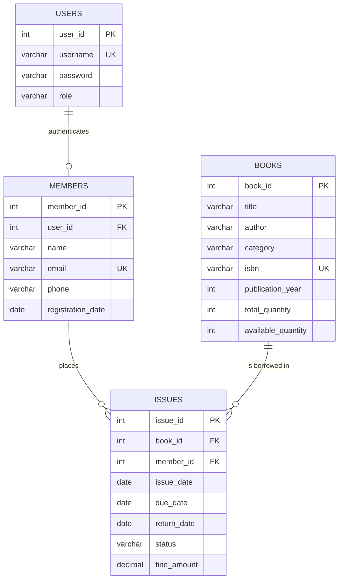

# Library Management System

A console-based Library Management System developed in **Java** using **JDBC** and **MySQL**. The application provides role-based access for librarians and library members to manage books, patrons, book issue/return operations, loan histories, and library analytics.

---

## Features

### Librarian (Admin)
- **Book Management:** Add new titles, view catalog, search by keyword/ID, update book information, and delete books (with active loan checks).
- **Member Management:** Register new members, search records, update contact details, and delete members.
- **Issue & Return Operations:** Issue books with a standard 14-day loan period, return books, and automatically calculate overdue fines.
- **Loan Tracking & Reports:** View all transactions, currently issued books, completed returns, overdue loans, and individual member loan history.
- **Library Dashboard:** Summary analytics showing total titles, total physical copies, registered patrons, circulation numbers, total fines collected, and category breakdown.

### Member (Patron)
- **Catalog Browsing:** Browse all books and search by title, author, category, or ISBN.
- **Personal Dashboard:** View currently borrowed books and due dates.
- **Borrowing History:** View complete loan history including return dates and fine details.

---

## Architecture & Project Structure

The project follows a layered architecture to keep presentation, business rules, and database persistence separate:

```
Library_Management/
├── lib/
│   └── mysql-connector-j-8.0.33.jar   # MySQL JDBC Driver
├── schema.sql                         # Database setup and seed data
└── src/
    └── library_management/
        ├── model/                     # Domain entities (Book, Member, IssueRecord, User, DashboardStats)
        ├── dao/                       # Data access interfaces and JDBC implementations
        ├── service/                   # Business rules, validations, and loan math
        ├── ui/                        # Console menus and table formatters
        ├── exception/                 # Custom domain exceptions
        ├── util/                      # DBConnection factory and safe input helpers
        └── Library_Management.java    # Application entry point
```

---

## Database Design

The system runs on a MySQL database (`library_db`) structured into four normalized tables:



### Key Database Rules
- **Referential Integrity:** `issues` references `books` and `members` using `ON DELETE RESTRICT` to ensure records with active or past loan history cannot be inadvertently deleted.
- **Stock Constraints:** `available_quantity` is validated via check constraint (`0 <= available_quantity <= total_quantity`).
- **Transactions:** Book issue and return operations use JDBC manual transactions (`setAutoCommit(false)`, `commit()`, and `rollback()`) with row locking (`FOR UPDATE`) to keep inventory and loan records synchronized.

---

## Tech Stack

- **Language:** Java (JDK 8+)
- **Database:** MySQL (XAMPP Port 3306)
- **Database Connectivity:** JDBC (MySQL Connector/J 8.0.33)
- **Build / IDE:** NetBeans IDE / Apache Ant

---

## Getting Started

### Prerequisites
1. Java Development Kit (JDK 8 or higher).
2. MySQL Server (e.g. through XAMPP or standalone MySQL).

### 1. Database Setup
1. Start MySQL (default port `3306`).
2. Run the `schema.sql` script to create `library_db` and insert seed data:
   ```bash
   mysql -u root -p < schema.sql
   ```
   *(If using XAMPP default settings, user is `root` with no password).*

### 2. Running the Application
- **In NetBeans:**
  1. Open the project in NetBeans.
  2. Ensure `lib/mysql-connector-j-8.0.33.jar` is listed in project libraries.
  3. Right-click `Library_Management.java` and select **Run File**.
- **Via Command Line:**
  ```bash
  javac -cp "lib/mysql-connector-j-8.0.33.jar" -d build/classes src/library_management/**/*.java src/library_management/*.java
  java -cp "build/classes;lib/mysql-connector-j-8.0.33.jar" library_management.Library_Management
  ```

### Default Login Accounts
| Role | Username | Password |
| :--- | :--- | :--- |
| **Librarian (Admin)** | `admin` | `admin123` |
| **Member** | `john_doe` | `member123` |
